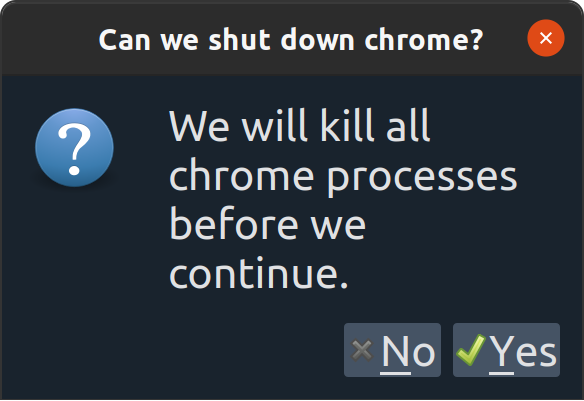
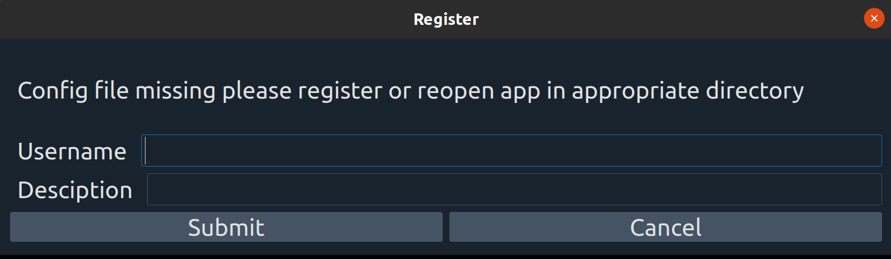

# Eavesdrop Capture

This application is for the express purpose of capturing pcaps for a predefined list of websites.

If you have any questions please contact us at: [wolfd@mail.gvsu.edu](mailto:wolfd@mail.gvsu.edu).

## Prerequisites

1. Linux or Windows computer (we have tested on Ubuntu 20.04 and Win 10)
2. [tshark installed](https://tshark.dev/setup/install/) with sudo/admin privileges (included in Linux installer but not 
   the Windows installer)
3. Chrome installed

Before you start the program, it's best to make sure chrome is shut down and that there are no ongoing tshark sniffing 
processes. Additionally, the data collected is sent to the server with the TLS session keys. This means the traffic from 
Chrome will be decrypted for the research, and you should use credentials that you created only for this capture process. 
One way to be safe is to capture traffic only from within a virtual machine. If you need us to purge data that you 
captured accidentally, please contact us at: [wolfd@mail.gvsu.edu](mailto:wolfd@mail.gvsu.edu), and include your machine 
name and the username you used to register.

When starting the program, this is the first message you will see. This is your opportunity to shut down Chrome. If not, 
we will kill it. This modal will appear whenever it is appropriate.

Upon opening the application for the first time you will be asked to register.  You will be unable to access the application. 

If it does not take, please try a different username, otherwise, please contact a worriedwolf admin.

When you have registered successfully, the full app should appear to you with your username and a GUID that is your id 
which the server will use to identify your machine.

Select a website and an action. Then click `start sniff`. A new chrome session will start and a keylogfile and pcap file 
will be created. The sniff is set to timeout after a few seconds, but the user may stop the sniff at any point before 
that by pressing `End Sniff`. The shorter the capture, the better the data 
quality for research purposes. 

You may either discard or send the data to us, and the application will reset itself for the next sniff.

## Testing and QA

If you are working on the agent code or simply want to try the capture agent out without sending junk data to the 
server, please run the application with an environmental variable of `SECONDARY_SERVER` set to `qa.`. Note the trailing 
period. This specifies that the agent should contact the subdomain QA site, 
[qa.worriedwolf.com](https://qa.worriedwolf.com) instead of the main site. This will not apply to most users.