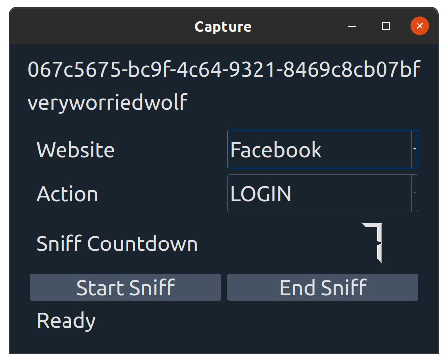
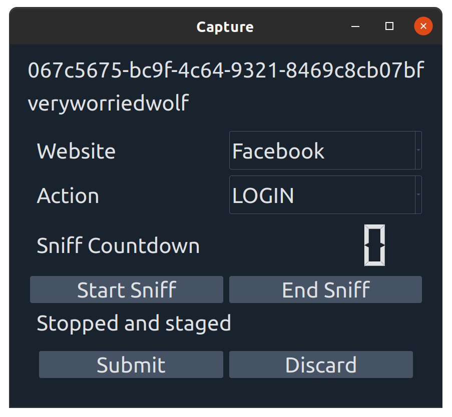

# Eavesdrop Capture

This application is for the express purpose of capturing pcaps for a predefined list of websites.

If you have any questions please contact us at: SOMEEMAIIL@ADDRESS

## Prerequisites

1. Linux, or WIndows laptop

2. tshark installed with sudo/admin privaliges

3. Chrome installed

Upon opening the application for the first time you will be asked to register.  You will be unable to access the application. If you have any problems, please contact a worriedwolf admin.

When you have registered successfully, the full app should appear to you with your username and a GUID that is your id. There will be meta data left on your machine in the current file directory. The program considers the current directory as the working directory. This means that if you run it from a different directory, none of your user information will propagate.

Select a website and an action and hit `start sniff`. A new chrome session start and a keylogfile and pcap file will be created in the directory. The sniff is set to timeout after a few seconds but the user may stop the sniff at any point before that by pressing `end sniff`

You may either discard or send the data to us and the application will reset itself for the next sniff.

